  <b>AI for complex engineering systems · multi-agent LLM systems · digital manufacturing</b> 
  📍 Copenhagen, Denmark

  
  
  
  
  

  
  
  

---

### 🧭 About me

I'm a Senior Researcher at DTU's Department of Civil and Mechanical Engineering (Engineering Design and Manufacturing Systems). My research sits at the intersection of **artificial intelligence, complex engineering systems, and digital manufacturing**: building computational models, machine-learning methods, and simulation frameworks that support data-driven decision-making in product development and manufacturing.

### 🔬 Research focus

| Area | What I work on |
|---|---|
| 🤖 **Agentic & multi-agent AI** | LLM-based multi-agent systems, agent-based reasoning, and evaluation of agentic AI for engineering workflows |
| 🏭 **AI for manufacturing** | Deep learning and recommendation systems for engineer-to-order product design |
| 🔍 **Explainable & constraint-driven AI** | Transparent, constraint-aware models for engineering decision support |
| 🧪 **Synthetic data** | Data generation methods for industrial and manufacturing settings |

### 🚀 Current projects

- **RECODE** · *Independent Research Fund Denmark (DFF), PI*: revolutionizing engineer-to-order companies with deep learning and advanced recommendation systems for product design
- **Multi-agent LLM systems**: architectures and evaluation methods for agentic AI in engineering and manufacturing

### 📚 Recent publications

<!--PUBLICATIONS:START-->
- Publication list is being connected to ORCID, see [Google Scholar](https://scholar.google.com/citations?user=LjqT4OEAAAAJ&hl=en) in the meantime.
<!--PUBLICATIONS:END-->

↻ This list updates automatically every week from ORCID. Full list: <a href="https://scholar.google.com/citations?user=LjqT4OEAAAAJ&hl=en">Google Scholar</a> · <a href="https://orbit.dtu.dk/en/persons/sara-shafiee/">DTU Orbit</a>

### 🏆 Recognition

- 🥇 **Agnes & Betzy Award** (2025)
- 🌍 **Nordic Women in Tech Award** (2022)
- 🏅 **Alexander Foss MADE Award**
- 💡 **Innovation Fund Denmark Industrial Researcher Prize**
- 📄 Multiple best paper awards (IEEE, ICED)

### 💼 Beyond academia

- **Founder & CEO, DivERS**
- Former IT Project Manager & Senior Business Consultant, **Haldor Topsøe**

### 🤝 Open to collaborations & visits

I welcome new collaborations and research visits, in both directions:

- 🔬 **Research collaborations**: joint papers, grant proposals, and shared projects in AI for engineering and manufacturing
- 🏭 **Industry partnerships**: applying AI, recommendation systems, and agentic workflows to real engineering and manufacturing problems
- ✈️ **Research visits**: hosting visiting researchers and PhD students at DTU, and visiting other groups and institutions
- 🎓 **PhD & postdoc inquiries**: always happy to hear from motivated candidates

📫 **sashaf [at] dtu [dot] dk** · 🌐 [sara-shaf.github.io](https://sara-shaf.github.io) · 💼 [LinkedIn](https://www.linkedin.com/in/sarashafiee/)
