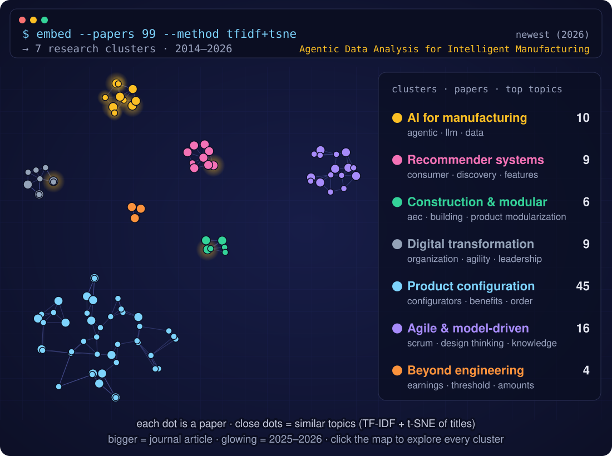
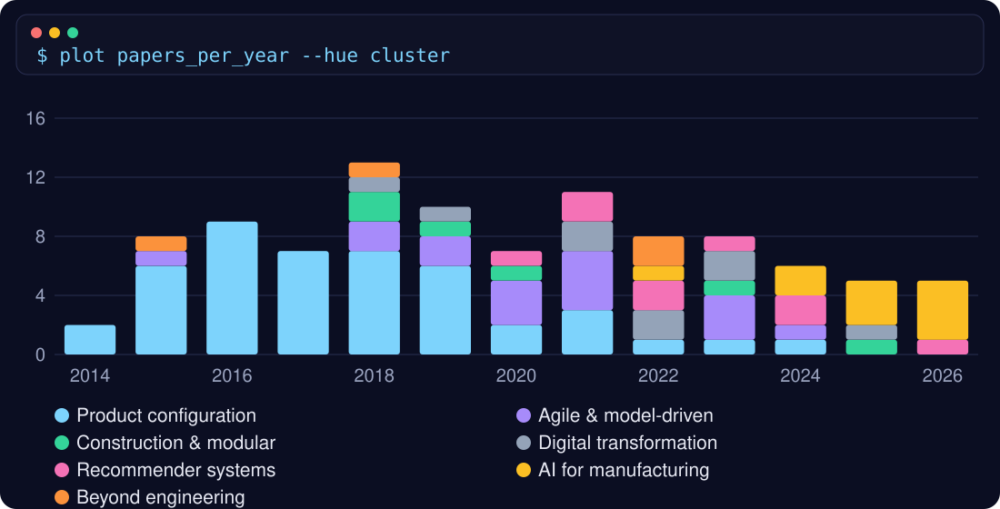

  <b>AI for complex engineering systems · multi-agent LLM systems · digital manufacturing</b> 
  📍 Copenhagen, Denmark

  
  
  
  
  

  
  

---

### 🧭 About me

I'm a Senior Researcher / Associate Professor at DTU's Department of Civil and Mechanical Engineering (Engineering Design and Manufacturing Systems). My research sits at the intersection of **artificial intelligence, complex engineering systems, and digital manufacturing**: building computational models, machine-learning methods, and simulation frameworks that support data-driven decision-making in product development and manufacturing.

### 🔬 Research focus

| Area | What I work on |
|---|---|
| 🤖 **Agentic & multi-agent AI** | LLM-based multi-agent systems, agent-based reasoning, and evaluation of agentic AI for engineering workflows |
| 🏭 **AI for manufacturing** | Deep learning and recommendation systems for engineer-to-order product design |
| 🔍 **Explainable & constraint-driven AI** | Transparent, constraint-aware models for engineering decision support |
| 🧪 **Synthetic data** | Data generation methods for industrial and manufacturing settings |

### 🚀 Current projects

- [**RECODE**](https://github.com/Sara-Shafiee-lab/RECODE) · **Principal Investigator**, Independent Research Fund Denmark (DFF) · hosted in my [lab](https://github.com/Sara-Shafiee-lab): revolutionizing engineer-to-order companies with deep learning and advanced recommendation systems for product design
- **Multi-agent LLM systems**: architectures and evaluation methods for agentic AI in engineering and manufacturing

### 📚 Recent publications

<!--PUBLICATIONS:START-->
- [How Consumer Attention Shapes Personalized Experiences in Generative AI Products: A Configurational Perspective](https://doi.org/10.1111/ijcs.70199) — International Journal of Consumer Studies · 2026
- [Evaluating Agentic AI Systems in Manufacturing: A Review of Taxonomy, Challenges and Future Directions](https://doi.org/10.1109/AAIML67890.2026.11498174) — Proceedings of the 2026 International Conference on Advances in Artificial Intelligence and Machine Learning · 2026
- [Synthetic data generation in manufacturing: A review of ethical and bias challenges](https://doi.org/10.1145/3800227.3800303) — 2025
- [Unsupervised Deep Learning for Rolling Bearing Anomaly Detection](https://doi.org/10.1145/3800227.3800273) — 2025
- [Enhancing efficiency and sustainability in construction: a product configurator for customizable off-site building solutions](https://doi.org/10.1080/17452007.2024.2434589) — Architectural Engineering and Design Management · 2025
- [Diversity and Team Learning in Intraorganizational Project Teams: The Mediating Role of Shared Leadership](https://doi.org/10.1177/87569728241270600) — Project Management Journal · 2025
- [Generative AI in manufacturing: a literature review of recent applications and future prospects](https://doi.org/10.1016/j.procir.2025.01.001) — Procedia CIRP · 2025
- [An iterative consumer-centric and technology-driven product innovation strategy based on selective and dynamic consumer attention](https://doi.org/10.1016/j.techfore.2024.123713) — Technological Forecasting and Social Change · 2024
<!--PUBLICATIONS:END-->

↻ This list updates automatically every week from ORCID. Full list: <a href="https://www.scopus.com/authid/detail.uri?authorId=56492736800">Scopus</a> · <a href="https://scholar.google.com/citations?user=LjqT4OEAAAAJ&hl=en">Google Scholar</a> · <a href="https://orbit.dtu.dk/en/persons/sara-shafiee/">DTU Orbit</a>

### 🗺️ Research map

↻ Updated automatically every week from ORCID.

<!--CLUSTERS:START-->
### Explore the clusters

Click a cluster to see its papers. Newest first.

🟡 <b>AI, agents &amp; digital manufacturing</b> · 10 papers · 2022–2026 · <i>agentic, llm, data</i>

- **2026** · [Agentic Data Analysis for Intelligent Manufacturing: Benchmark-Driven Evaluation of Agentic vs. Direct LLM Approaches](https://scholar.google.com/scholar?q=Agentic%20Data%20Analysis%20for%20Intelligent%20Manufacturing%3A%20Benchmark-Driven%20Evaluation%20of%20Agentic%20vs.%20Direct%20LLM%20Approaches) · *Procedia CIRP* · [code](https://github.com/Nastaran95/agentic-man-da)
- **2026** · [CPJudgeBench: Meta-Evaluation of LLM Judges for Constraint Programming through Solution-Space Semantics](https://scholar.google.com/scholar?q=CPJudgeBench%3A%20Meta-Evaluation%20of%20LLM%20Judges%20for%20Constraint%20Programming%20through%20Solution-Space%20Semantics) · *EMNLP 2026 (Main)* · [code](https://github.com/Nastaran95/CPJudgeBench)
- **2026** · [Evaluating Agentic AI Systems in Manufacturing: A Review of Taxonomy, Challenges and Future Directions](https://doi.org/10.1109/AAIML67890.2026.11498174) · *2026 International Conference on Advances in Artificial Intelligence and Machine Learning (AAIML)* · [code](https://github.com/Nastaran95/manufacturing-agentic-evaluation)
- **2026** · [Synthetic data generation in manufacturing: a review of methods, domains, and emerging trends](https://scholar.google.com/scholar?q=Synthetic%20data%20generation%20in%20manufacturing%3A%20a%20review%20of%20methods%2C%20domains%2C%20and%20emerging%20trends) · *Procedia CIRP*
- **2025** · [Generative AI in manufacturing: A literature review of recent applications and future prospects](https://doi.org/10.1016/j.procir.2025.01.001) · *Procedia CIRP*
- **2025** · [Synthetic data generation in manufacturing: A review of ethical and bias challenges](https://doi.org/10.1145/3800227.3800303) · *Proceedings of the 2025 5th International Conference on Big Data, Artificial Intelligence and Risk Management*
- **2025** · [Unsupervised Deep Learning for Rolling Bearing Anomaly Detection](https://doi.org/10.1145/3800227.3800273) · *Proceedings of the 2025 5th International Conference on Big Data, Artificial Intelligence and Risk Management*
- **2024** · [Integration of product and manufacturing design: A systematic literature review](https://doi.org/10.1016/j.procir.2023.09.224) · *Procedia CIRP*
- **2024** · [Unleashing manufacturing potential: a simulation-based journey towards optimal efficiency](https://doi.org/10.1016/j.procir.2024.01.007) · *Procedia CIRP*
- **2022** · [Integrating product configuration systems with manufacturing system reconfiguration](https://doi.org/10.1016/j.procir.2022.05.098) · *Procedia CIRP*

🩷 <b>Data-driven product innovation &amp; recommender systems</b> · 9 papers · 2020–2026 · <i>consumer, discovery, features</i>

- **2026** · [How Consumer Attention Shapes Personalized Experiences in Generative AI Products: A Configurational Perspective](https://doi.org/10.1111/ijcs.70199) · *International Journal of Consumer Studies*
- **2024** · [An iterative consumer-centric and technology-driven product innovation strategy based on selective and dynamic consumer attention](https://doi.org/10.1016/j.techfore.2024.123713) · *Technological Forecasting and Social Change*
- **2024** · [Unveiling the latest trends and advancements in machine learning algorithms for recommender systems: a literature review](https://doi.org/10.1016/j.procir.2023.08.062) · *Procedia CIRP*
- **2023** · [Ranking products through online reviews considering the mass assignment of features based on BERT and q-rung orthopair fuzzy set theory](https://doi.org/10.1016/j.eswa.2022.119142) · *Expert Systems with Applications*
- **2022** · [Application of Expert Systems for Personalizing Financial Decisions](https://doi.org/10.1017/pds.2022.82) · *Proceedings of the Design Society*
- **2022** · [Discovery of Product Features for Redesign from User Implicit Feedback](https://doi.org/10.1155/2022/7021431)
- **2021** · [An online community-based dynamic customisation model: the trade-off between customer satisfaction and enterprise profit](https://doi.org/10.1080/00207543.2019.1693649) · *International Journal of Production Research*
- **2021** · [Discovery of associated consumer demands: Construction of a co-demanded product network with community detection](https://doi.org/10.1016/j.eswa.2021.115038) · *Expert Systems with Applications*
- **2020** · [A “User-Knowledge-Product” Co-Creation Cyberspace Model for Product Innovation](https://doi.org/10.1155/2020/7190169) · *Complexity*

🟢 <b>Construction &amp; modular design</b> · 6 papers · 2018–2025 · <i>aec, building, product modularization</i>

- **2025** · [Enhancing efficiency and sustainability in construction: a product configurator for customizable off-site building solutions](https://doi.org/10.1080/17452007.2024.2434589) · *Architectural Engineering and Design Management*
- **2023** · [Product configurator as a monitoring tool for environmental impact: An AEC perspective](https://doi.org/10.1007/978-3-031-34821-1_12) · *Proceedings of the Changeable, Agile, Reconfigurable and Virtual Production Conference and the World Mass Customization & Personalization Conference*
- **2020** · [Modularisation strategies in the AEC industry: a comparative analysis](https://doi.org/10.1080/17452007.2020.1735291) · *Architectural Engineering and Design Management*
- **2019** · [Configuration platform for customisation of design, manufacturing and assembly processes of building faccade systems: A building information modelling perspective](https://doi.org/10.1016/j.autcon.2019.102914) · *Automation in construction*
- **2018** · [Product modularization in the architecture, engineering and construction (aec) industry](https://scholar.google.com/scholar?q=Product%20modularization%20in%20the%20architecture%2C%20engineering%20and%20construction%20%28aec%29%20industry) · *Proceedings of 2nd European International Conference on Industrial Engineering and Operations Management (IEOM)*
- **2018** · [Product modularization: Case studies from construction industries](https://scholar.google.com/scholar?q=Product%20modularization%3A%20Case%20studies%20from%20construction%20industries) · *8th International Conference on Mass Customization and Personalization*

⚪ <b>Organisation, leadership &amp; digital transformation</b> · 9 papers · 2018–2025 · <i>organization, agility, leadership</i>

- **2025** · [Diversity and team learning in intraorganizational project teams: The mediating role of shared leadership](https://doi.org/10.1177/87569728241270600) · *Project Management Journal*
- **2023** · [An empirical study on customers’ behavior of passive and active resistance to innovation](https://doi.org/10.1080/1331677X.2023.2179515) · *Economic research-Ekonomska istravzivanja*
- **2023** · [Shared leadership and employee-well-being: An investigation of whether and when in innovative project teams](https://scholar.google.com/scholar?q=Shared%20leadership%20and%20employee-well-being%3A%20An%20investigation%20of%20whether%20and%20when%20in%20innovative%20project%20teams) · *6th Interdisciplinary Perspectives on Leadership Symposium*
- **2022** · [Imperfect Reintegration in Temporary Organizing: Implications for Individuals and Organizations](https://scholar.google.com/scholar?q=Imperfect%20Reintegration%20in%20Temporary%20Organizing%3A%20Implications%20for%20Individuals%20and%20Organizations) · *38th EGOS Colloquium 2022*
- **2022** · [Optimizing Joint Sustainable Supply Chain Decision-making under Emission Tax: A Stackelberg Game Model](https://doi.org/10.1109/IEEM55944.2022.9989876) · *2022 IEEE International Conference on Industrial Engineering and Engineering Management (IEEM)*
- **2021** · [Improving the Patient Visit Process in the Pre-treatment Phase](https://doi.org/10.1007/978-3-030-90700-6_111) · *Proceedings of the Changeable, Agile, Reconfigurable and Virtual Production Conference and the World Mass Customization & Personalization Conference*
- **2021** · [Organization design in motion: Designing an organization for agility](https://doi.org/10.1017/pds.2021.496) · *Proceedings of the Design Society*
- **2019** · [Rethinking organization design to enforce organizational agility](https://scholar.google.com/scholar?q=Rethinking%20organization%20design%20to%20enforce%20organizational%20agility) · *11th Symposium on Competence-Based Strategic Management (SKM 2019)*
- **2018** · [Challenges of digital transformation: The case of the non-profit sector](https://doi.org/10.1109/IEEM.2018.8607762) · *2018 IEEE international conference on industrial engineering and engineering management (IEEM)*

🔵 <b>Product configuration &amp; mass customization</b> · 45 papers · 2014–2024 · <i>configurators, benefits, order</i>

- **2024** · [Streamlining customization and standardization: Improving configuration lifecycle management](https://doi.org/10.1016/j.procir.2024.01.020) · *Procedia CIRP*
- **2023** · [Framing business cases for the success of product configuration system projects](https://doi.org/10.1016/j.compind.2022.103839) · *Computers in Industry*
- **2022** · [Developing separate or integrated configurators? A longitudinal case study](https://doi.org/10.1016/j.ijpe.2022.108517) · *International Journal of Production Economics*
- **2021** · [Complexity Management in Engineer-To-Order Industry: A Design-Time Estimation Model for Engineering Processes](https://doi.org/10.1007/978-3-030-90700-6_72) · *Proceedings of the Changeable, Agile, Reconfigurable and Virtual Production Conference and the World Mass Customization & Personalization Conference*
- **2021** · [Developing Integrated Configurators: A Longitudinal Case Study](https://doi.org/10.1109/IEEM50564.2021.9672992) · *2021 IEEE International Conference on Industrial Engineering and Engineering Management (IEEM)*
- **2021** · [The costs and benefits of multistage configuration: A framework and case study](https://doi.org/10.1016/j.cie.2020.107095) · *Computers & Industrial Engineering*
- **2020** · [COMPARING THE PRODUCT CONFIGURATION BENEFITS IN ENGINEERING AND QUOTATION PHASES](https://scholar.google.com/scholar?q=COMPARING%20THE%20PRODUCT%20CONFIGURATION%20BENEFITS%20IN%20ENGINEERING%20AND%20QUOTATION%20PHASES) · *Conference on Mass Customizaon and Personalizaon -- Community of Europe (MCP - CE 2020)*
- **2020** · [Complexity of Configurators Relative to Types of Outputs](https://scholar.google.com/scholar?q=Complexity%20of%20Configurators%20Relative%20to%20Types%20of%20Outputs)
- **2019** · [Comparing the gained benefits from product configuration systems based on maintenance efforts](https://scholar.google.com/scholar?q=Comparing%20the%20gained%20benefits%20from%20product%20configuration%20systems%20based%20on%20maintenance%20efforts) · *Workshop on Configuration 2019 (ConfWS’19)*
- **2019** · [Development of a Design-Time Estimation Model for Complex Engineering Processes](https://doi.org/10.3233/ATDE190136) · *Transdisciplinary Engineering for Complex Socio-technical Systems: Proceedings of the 26th ISTE International Conference on Transdisciplinary Engineering, July 30--August 1, 2019*
- **2019** · [Prioritizing Products for Profitable Investments on Product Configuration Systems](https://scholar.google.com/scholar?q=Prioritizing%20Products%20for%20Profitable%20Investments%20on%20Product%20Configuration%20Systems) · *Workshop on Configuration 2019 (ConfWS’19)*
- **2019** · [The causes of product configuration project failure](https://doi.org/10.1016/j.compind.2019.03.002) · *Computers in Industry*
- **2019** · [The costs and benefits of product configuration projects in engineer-to-order companies](https://doi.org/10.1016/j.compind.2018.11.005) · *Computers in Industry*
- **2019** · [The impact of applying product-modelling techniques in configurator projects](https://doi.org/10.1080/00207543.2018.1436783) · *International Journal of Production Research*
- **2018** · [A database administration tool to model the configuration projects](https://doi.org/10.1109/IEEM.2018.8607654) · *2018 IEEE International Conference on Industrial Engineering and Engineering Management (IEEM)*
- **2018** · [Cost benefit analysis in product configuration systems](https://scholar.google.com/scholar?q=Cost%20benefit%20analysis%20in%20product%20configuration%20systems) · *Configuration Workshop 2018*
- **2018** · [How to scope configuration projects and manage the knowledge they require](https://doi.org/10.1108/JKM-01-2017-0017) · *Journal of Knowledge Management*
- **2018** · [Management Challenges in Product Configuration Projects](https://scholar.google.com/scholar?q=Management%20Challenges%20in%20Product%20Configuration%20Projects) · *2nd European International Conference on Industrial Engineering and Operations Management*
- **2018** · [Merging commercial and technical configurators](https://scholar.google.com/scholar?q=Merging%20commercial%20and%20technical%20configurators) · *8th International Conference on Mass Customization and Personalization*
- **2018** · [Return on investment from the use of product configuration systems--A case study](https://doi.org/10.1016/j.compind.2018.04.003) · *Computers in Industry*
- **2018** · [The main challenges for manufacturing companies in implementing and utilizing configurators](https://doi.org/10.1016/j.compind.2018.05.001) · *Computers in Industry*
- **2017** · [Automatic Identification of Similarities Across Products to Improve the Configuration Process in ETO Companies](https://scholar.google.com/scholar?q=Automatic%20Identification%20of%20Similarities%20Across%20Products%20to%20Improve%20the%20Configuration%20Process%20in%20ETO%20Companies) · *International Journal of Industrial Engineering and Management*
- **2017** · [Complexity of Configurators Relative to Integrations and Field of Application](https://scholar.google.com/scholar?q=Complexity%20of%20Configurators%20Relative%20to%20Integrations%20and%20Field%20of%20Application) · *19th International Configuration Workshop*
- **2017** · [Conceptual Modelling for Product Configuration Systems](https://scholar.google.com/scholar?q=Conceptual%20Modelling%20for%20Product%20Configuration%20Systems)
- **2017** · [How to Identify Possible Applications of Product Configuration Systems in Engineer-to-Order Companies](https://scholar.google.com/scholar?q=How%20to%20Identify%20Possible%20Applications%20of%20Product%20Configuration%20Systems%20in%20Engineer-to-Order%20Companies) · *International Journal of Industrial Engineering and Management (IJIEM)*
- **2017** · [Make your own product in the Customerpedia](https://scholar.google.com/scholar?q=Make%20your%20own%20product%20in%20the%20Customerpedia)
- **2017** · [The documentation of product configuration systems: A framework and an IT solution](https://doi.org/10.1016/j.aei.2017.02.004) · *Advanced Engineering Informatics*
- **2017** · [Usage Frequency of Product Configuration Systems Relative to Integrations and Fields of Application](https://doi.org/10.1109/IEEM.2017.8289882)
- **2016** · [Analysis of Product Modelling Techniques for Product Configuration Systems in Industrial Companies](https://scholar.google.com/scholar?q=Analysis%20of%20Product%20Modelling%20Techniques%20for%20Product%20Configuration%20Systems%20in%20Industrial%20Companies) · *2016 International Conference on Industrial Engineering and Engineering Management: IEEM 2016*
- **2016** · [BUSINESS CASES FOR PRODUCT CONFIGURATION SYSTEMS](https://scholar.google.com/scholar?q=BUSINESS%20CASES%20FOR%20PRODUCT%20CONFIGURATION%20SYSTEMS) · *7th International Conference on Mass Customization and Personalization in Central Europe (MCP - CE 2016)*
- **2016** · [Development and implementation strategy for the of product configuration systems in engineer-to-order companies](https://doi.org/10.1109/IEEM.2016.7798190) · *2016 IEEE International Conference on Industrial Engineering and Engineering Management (IEEM)*
- **2016** · [Impact of the utilization of a product configuration system on product’s life cycle complexity](https://scholar.google.com/scholar?q=Impact%20of%20the%20utilization%20of%20a%20product%20configuration%20system%20on%20product%E2%80%99s%20life%20cycle%20complexity) · *5th World conference on Production and operations Management*
- **2016** · [Improved Performance and Quality of Configurators by Receiving Real-Time Information from Suppliers](https://scholar.google.com/scholar?q=Improved%20Performance%20and%20Quality%20of%20Configurators%20by%20Receiving%20Real-Time%20Information%20from%20Suppliers) · *Configuration Workshop, At Toulouse, France*
- **2016** · [Industrial Application of Configurators: From Motivations to Realized Benefits](https://scholar.google.com/scholar?q=Industrial%20Application%20of%20Configurators%3A%20From%20Motivations%20to%20Realized%20Benefits) · *18th International Conference on Industrial Engineering*
- **2016** · [Industrial experience from using the cpm-procedure for developing, implementing and maintaining product configuration systems](https://scholar.google.com/scholar?q=Industrial%20experience%20from%20using%20the%20cpm-procedure%20for%20developing%2C%20implementing%20and%20maintaining%20product%20configuration%20systems) · *18th International Conference on Industrial Engineering*
- **2016** · [Product configuration system and its impact on product's life cycle complexity](https://scholar.google.com/scholar?q=Product%20configuration%20system%20and%20its%20impact%20on%20product%27s%20life%20cycle%20complexity) · *2016 IEEE International Conference on Industrial Engineering and Engineering Management (IEEM)*
- **2016** · [QUANTIFICATION OF BENEFITS AND COST FROM APPLYING A PRODUCT CONFIGURATION SYSTEM](https://scholar.google.com/scholar?q=QUANTIFICATION%20OF%20BENEFITS%20AND%20COST%20FROM%20APPLYING%20A%20PRODUCT%20CONFIGURATION%20SYSTEM) · *7th International Conference on Mass Customization and Personalization in Central Europe (MCP - CE 2016)*
- **2015** · [Alignment of Configuration and Documentation for Highly Engineered Complex Product Configuration Systems: a Demonstration from a Case Study](https://doi.org/10.1109/WI-IAT.2015.40) · *IEEE/WIC/ACM Web Intelligence Conference 2015 IEEE/WIC/ACM. Intelligent Agent Technology Conference 2015*
- **2015** · [Analysis of Visual Representation Techniques for Product Configuration Systems in Industrial Companies](https://doi.org/10.1109/IEEM.2016.7797985) · *Industrial Engineering and Engineering Management (IEEM), 2016 IEEE International Conference on*
- **2015** · [Goal-Oriented Data Collection Framework in Configuration Projects](https://scholar.google.com/scholar?q=Goal-Oriented%20Data%20Collection%20Framework%20in%20Configuration%20Projects) · *The 2015 World Conference on Mass Customization, Personalization, and Co-Creation (MCPC 2015)*
- **2015** · [How to Analyze and Quantify Similarities between Configured Engineer-To-Order Products by Comparing the Highlighted Features Utilizing the Configuration System Abilities](https://scholar.google.com/scholar?q=How%20to%20Analyze%20and%20Quantify%20Similarities%20between%20Configured%20Engineer-To-Order%20Products%20by%20Comparing%20the%20Highlighted%20Features%20Utilizing%20the%20Configuration%20System%20Abilities) · *17th International Configuration Workshop*
- **2015** · [Identification of Profitable Areas to Apply Product Configuration Systems in Engineering-To-Order Companies](https://scholar.google.com/scholar?q=Identification%20of%20Profitable%20Areas%20to%20Apply%20Product%20Configuration%20Systems%20in%20Engineering-To-Order%20Companies) · *The 2015 World Conference on Mass Customization, Personalization, and Co-Creation (MCPC 2015)*
- **2015** · [Utilizing Product Configuration Systems for Supporting the Critical Parts of the Engineering Processes](https://doi.org/10.1109/IEEM.2015.7385953) · *IEEE International Conference on Industrial Engineering and Engineering Management (IEEM)*
- **2014** · [How to scope a product configuration project in an engineering company](https://scholar.google.com/scholar?q=How%20to%20scope%20a%20product%20configuration%20project%20in%20an%20engineering%20company) · *6th International Conference on Mass Customization and Personalization in Central Europe*
- **2014** · [Scoping a product configuration project for engineer-to-order companies](https://scholar.google.com/scholar?q=Scoping%20a%20product%20configuration%20project%20for%20engineer-to-order%20companies) · *International Journal of Industrial Engineering and Management*

🟣 <b>Agile &amp; model-driven engineering of configurators</b> · 16 papers · 2015–2024 · <i>scrum, design thinking, knowledge</i>

- **2024** · [The impact of model-driven development on agile practices within knowledge-intensive systems engineering](https://scholar.google.com/scholar?q=The%20impact%20of%20model-driven%20development%20on%20agile%20practices%20within%20knowledge-intensive%20systems%20engineering) · *3rd International Workshop on Agile Methods for Information Systems Engineering*
- **2023** · [An empirical evaluation of scrum training’s suitability for the model-driven development of knowledge-intensive software systems](https://doi.org/10.1016/j.datak.2023.102195) · *Data & Knowledge Engineering*
- **2023** · [Customer-centric UI/UX design for sustainable software systems](https://doi.org/10.1007/978-3-031-34821-1_17) · *Proceedings of the Changeable, Agile, Reconfigurable and Virtual Production Conference and the World Mass Customization & Personalization Conference*
- **2023** · [The Mass Customization Projects Enactment in Practice: Traditional Versus Agile Project Management](https://doi.org/10.1007/978-3-031-34821-1_7) · *Proceedings of the Changeable, Agile, Reconfigurable and Virtual Production Conference and the World Mass Customization & Personalization Conference*
- **2021** · [A strategic approach to improve the development of use-oriented knowledge-based engineering configurators (KBEC)](https://doi.org/10.1016/j.procir.2021.01.078) · *Procedia CIRP*
- **2021** · [Application of design thinking to product-configuration projects](https://doi.org/10.1108/JMTM-04-2020-0137) · *Journal of Manufacturing Technology Management*
- **2021** · [Evaluating the benefits of a computer-aided software engineering tool to develop and document product configuration systems](https://doi.org/10.1016/j.compind.2021.103432) · *Computers in Industry*
- **2021** · [Four independent knowledge domains to enable an agile, distributed development of user-centred engineering configurators](https://doi.org/10.1016/j.procir.2021.10.021) · *Procedia CIRP*
- **2020** · [A development approach towards user-centered front-ends for knowledge-based engineering configurators: a study within planning of robot-based automation solutions](https://scholar.google.com/scholar?q=A%20development%20approach%20towards%20user-centered%20front-ends%20for%20knowledge-based%20engineering%20configurators%3A%20a%20study%20within%20planning%20of%20robot-based%20automation%20solutions) · *22nd International Configuration Workshop (CONFWS'20)*
- **2020** · [Scrum training for product configuration systems development](https://doi.org/10.35199/NORDDESIGN2020.49) · *DS 101: Proceedings of NordDesign 2020, Lyngby, Denmark, 12th-14th August 2020*
- **2020** · [Scrum versus Rational Unified Process in facing the main challenges of product configuration systems development](https://doi.org/10.1016/j.jss.2020.110732) · *Journal of Systems and Software*
- **2019** · [Complementing the scoping process of configuration projects by design thinking](https://doi.org/10.3233/ATDE190105) · *26th ISTE International Conference on Transdisciplinary Engineering*
- **2019** · [Revisiting the product configuration systems development procedure for scrum compliance: An i* driven process fragment](https://doi.org/10.1007/978-3-030-35333-9_31) · *International Conference on Product-Focused Software Process Improvement*
- **2018** · [Behavior-driven development in product configuration systems](https://scholar.google.com/scholar?q=Behavior-driven%20development%20in%20product%20configuration%20systems) · *Proceedings of the 20th Configuration Workshop*
- **2018** · [Design Thinking in Product Configuration Projects](https://scholar.google.com/scholar?q=Design%20Thinking%20in%20Product%20Configuration%20Projects) · *2nd European International Conference on Industrial Engineering and Operations Management*
- **2015** · [An agile documentation system for highly engineered, complex product configuration systems](https://scholar.google.com/scholar?q=An%20agile%20documentation%20system%20for%20highly%20engineered%2C%20complex%20product%20configuration%20systems) · *22nd EurOMA Conference*

🟠 <b>Collaborations beyond engineering</b> · 4 papers · 2015–2022 · <i>earnings, threshold, amounts</i>

- **2022** · [Investigate earnings management at the sensitive earnings amounts’ threshold of companies with high financial leverage](https://scholar.google.com/scholar?q=Investigate%20earnings%20management%20at%20the%20sensitive%20earnings%20amounts%E2%80%99%20threshold%20of%20companies%20with%20high%20financial%20leverage) · *Management Accounting*
- **2022** · [The Examination of Real Earnings Management on the Threshold of Sensitive Earnings Amounts](https://scholar.google.com/scholar?q=The%20Examination%20of%20Real%20Earnings%20Management%20on%20the%20Threshold%20of%20Sensitive%20Earnings%20Amounts) · *Journal of Management Accounting and Auditing Knowledge*
- **2018** · [Teachers' Evaluation of the ILI High Intermediate Book Series through an Eclectic Checklist](https://scholar.google.com/scholar?q=Teachers%27%20Evaluation%20of%20the%20ILI%20High%20Intermediate%20Book%20Series%20through%20an%20Eclectic%20Checklist) · *Theory and Practice in Language Studies*
- **2015** · [Antibacterial performance of nano polypropylene filter media containing nano-TiO2 and clay particles](https://doi.org/10.1007/s11051-015-3195-y) · *Journal of Nanoparticle Research*

<!--CLUSTERS:END-->

### 🧑‍🔬 Research code & lab

My group's shared space on GitHub is **[Sara Shafiee Lab](https://github.com/Sara-Shafiee-lab)**, home of the DFF-funded [**RECODE**](https://github.com/Sara-Shafiee-lab/RECODE) project.

| Paper | Venue | Code |
|---|---|---|
| CPJudgeBench: Meta-Evaluation of LLM Judges for Constraint Programming through Solution-Space Semantics | EMNLP 2026 (Main) | [Nastaran95/CPJudgeBench](https://github.com/Nastaran95/CPJudgeBench) |
| Evaluating Agentic AI Systems in Manufacturing: A Review of Taxonomy, Challenges, and Future Directions | AAIML 2026 | [Nastaran95/manufacturing-agentic-evaluation](https://github.com/Nastaran95/manufacturing-agentic-evaluation) |
| Agentic Data Analysis for Intelligent Manufacturing: Benchmark-Driven Evaluation of Agentic vs. Direct LLM Approaches | CIRPe 2025 | [Nastaran95/agentic-man-da](https://github.com/Nastaran95/agentic-man-da) |
| Advancing reliable evaluation of AI-generated constraint models | 🔒 Coming soon | [CPJudgeBenchPlus](https://github.com/Nastaran95/CPJudgeBenchPlus) |
| Understanding how AI is used to evaluate code | 🔒 Coming soon | [meta-eval-for-code](https://github.com/Nastaran95/meta-eval-for-code) |
| AI agents for analysing building information models | 🔒 Coming soon | [SmartBIM-Agent](https://github.com/Nastaran95/SmartBIM-Agent) |

Code maintained by my PhD student <a href="https://github.com/Nastaran95">Nastaran Moradzadeh Farid</a>.

### 🏆 Recognition

- 🥇 **Agnes & Betzy Award** (2025)
- 🌍 **Nordic Women in Tech Award** (2022)
- 🏅 **Alexander Foss MADE Award**
- 💡 **Innovation Fund Denmark Industrial Researcher Prize**
- 📄 Multiple best paper awards (IEEE, ICED)

### 💼 Beyond academia

- **Founder & CEO, DivERS**
- Former IT Project Manager & Senior Business Consultant, **Topsoe**

### 🤝 Work with me

> [!TIP]
> **Open to students and researchers**
>
> I welcome students and researchers who would like to work with me on AI for engineering and manufacturing, multi-agent LLM systems, and recommendation systems.
>
> - 🎓 **Students:** MSc thesis projects, PhD positions, and research assistant roles
> - 🔬 **Researchers:** postdocs, visiting researchers, and joint projects or grant proposals
> - ✈️ **Visits:** I host visiting researchers and PhD students at DTU and am glad to visit other groups
>
> 📫 Get in touch: **sashaf [at] dtu [dot] dk**
